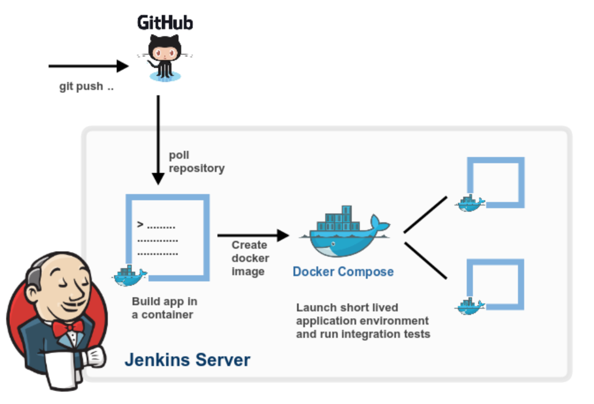
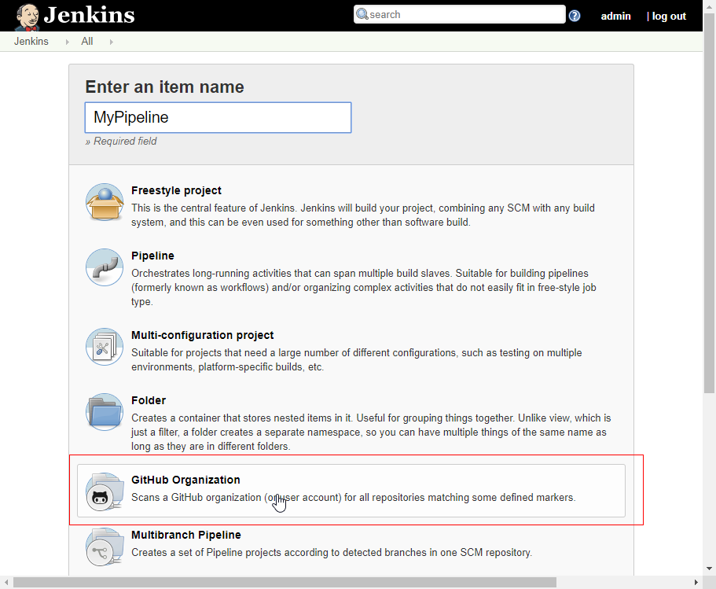
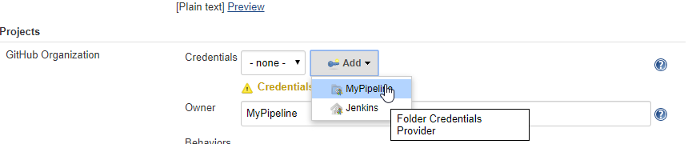
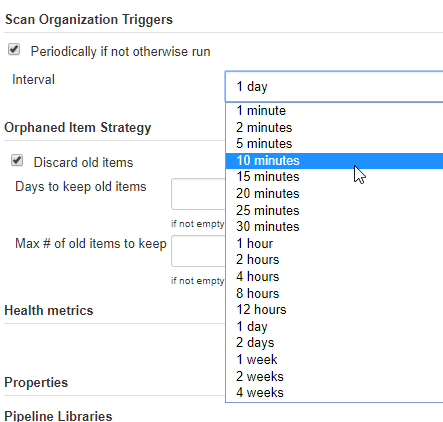
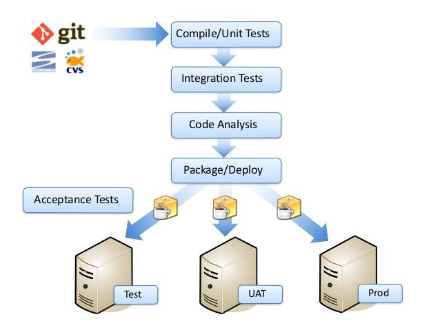
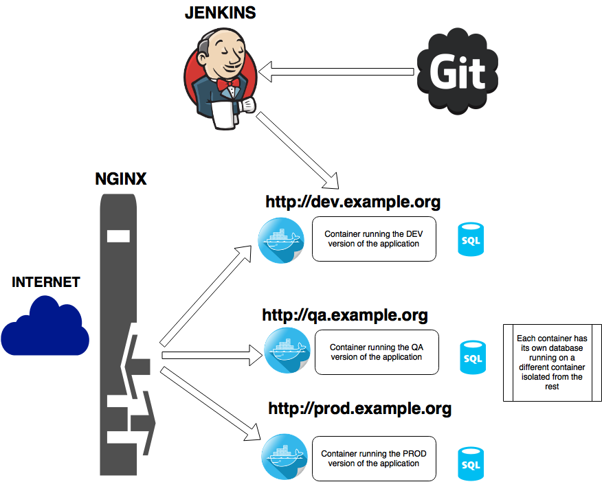
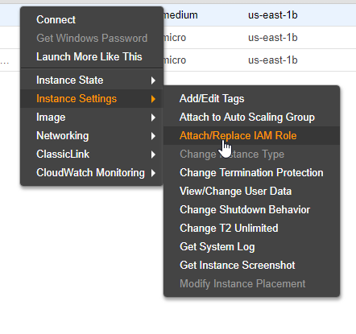
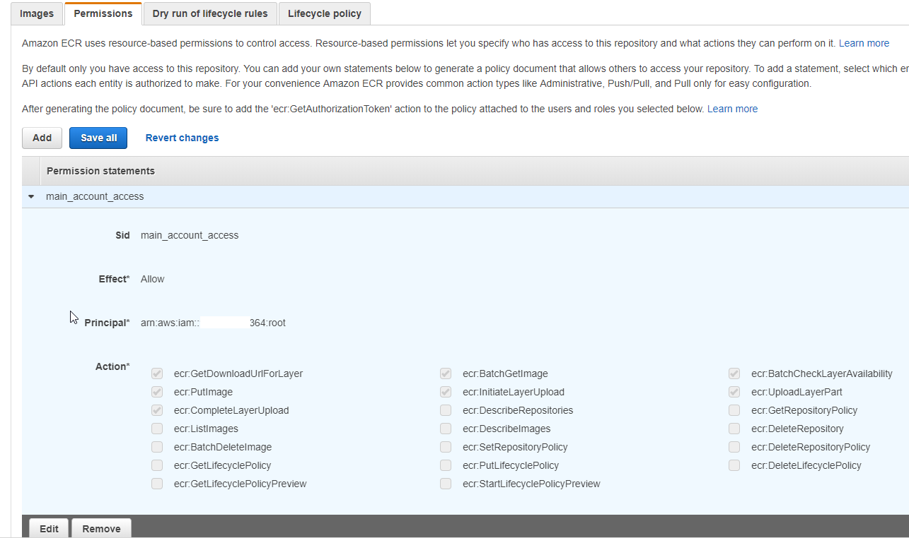

# A lean Continuous Deployment, Testing and Integration Pipeline using CoreOS/Docker/Jenkins

By Rodrigo A. Diaz Leven

- [A lean Continuous Deployment, Testing and Integration Pipeline using CoreOS/Docker/Jenkins](#a-lean-continuous-deployment--testing-and-integration-pipeline-using-coreos-docker-jenkins)
  * [Disclaimer and prologue](#disclaimer-and-prologue)
  * [Integration](#integration)
  * [CoreOS install](#coreos-install)
  * [Jenkins and Nginx](#jenkins-and-nginx)
    + [Jenkins Dockerfile](#jenkins-dockerfile)
    + [Nginx Dockerfile](#nginx-dockerfile)
    + [Binding everything with docker-compose](#binding-everything-with-docker-compose)
    + [Systemd service for Jenkins/Nginx](#systemd-service-for-jenkins-nginx)
    + [Configuring Jenkins](#configuring-jenkins)
    + [Jenkins Pipeline Code](#jenkins-pipeline-code)
- [Unit Testing](#unit-testing)
- [Deployment to Development](#deployment-to-development)
  * [Deploying the image on build pass](#deploying-the-image-on-build-pass)
    + [Installing Python in CoreOS](#installing-python-in-coreos)
    + [Installing Docker-puller](#installing-docker-puller)
      - [The configuration will be:](#the-configuration-will-be-)
    + [Docker-puller as a OS service](#docker-puller-as-a-os-service)
    + [Example application Project1](#example-application-project1)
    + [Dockerfile for our applications](#dockerfile-for-our-applications)
      - [API application](#api-application)
- [Deployment to Production in AWS](#deployment-to-production-in-aws)
  * [AWS Configuration](#aws-configuration)
  * [Instances configurations](#instances-configurations)
  * [Jenkins](#jenkins)

## Disclaimer and prologue

We are going to use CoreOS as the base of our pipeline because in my opinion it's the best suited to build cloud immutable servers with the right Docker support at the kernel level.

The idea behind CoreOS is that an installation can be replicated many times without the use of an external application like Ansible or Puppet.

This is done by writing a configuration file that the installer reads and execute at install time  to configure the OS as you see fit and also can be used to replicate the same server build many times.

We could say that this a way to have "OS as code" the same as we have “Infrastructure as code” with Terraform.

More documentation on this can be found here:[ https://coreos.com/os/docs/latest/provisioning.html](https://coreos.com/os/docs/latest/provisioning.html)

However we will **NOT **be using this technique besides the initial configuration because it's beyond the scope of this article and so its left as an exercise to the reader.

## Integration



The idea behind this pipeline is to do continuous integration and deployment of an applications using Docker as a way to virtualize the environments and Jenkins for the automatization side but any technology can be use to replace them like [RTK ](https://coreos.com/rkt/)and [CircleCI](https://circleci.com/).

Another requirement met is to use a simple and super lean infrastructure of a single server with a minimum of 4GB of ram.

We won't be using any clusters, like Kubernetes or Docker Swarm or any other type of container orchestration since it would be outside of the scope of this Article, but the same principles can be used.

Everything will run under a Docker container, this way it will be an immutable server, even Jenkins and Nginx.

We will use a django application as an example that has a frontend, backend and a database running in postgres, something really common this days, but any type of application that can be run in a container can work in this pipeline.

Jenkins will poll the branches for commits or pull requests and  will checkout the code,create a Docker image for the proper branch and optionally push it to the registry and tag it.

However this Docker image will first has to pass our Unit testing and then it will be deployed, if it fails we will be notified and the image will not be used.

Its very important that the developers use the same environments to the one that are put into produccion to minimize runtime errors.

This means that the developers should use the docker images we create to run the application while they are modifying it.

This way we make sure that there won't be any runtime errors when we deploy to production.

## CoreOS install

We will deploy a local VM , you can use any type of deployment that CoreOS accepts:

[https://coreos.com/os/docs/latest/](https://coreos.com/os/docs/latest/)

File: coreos/cloud-config.yml 


```yaml
#cloud-config
ssh_authorized_keys:

- ssh-rsa AAAAB3....

hostname: Pipe1
users:
- name: "core"
  groups:
  - sudo
  - docker
    coreos:
     update:
    reboot-strategy: off
     units:
  - name: systemd-networkd.service
    command: stop
  - name: static.network
    runtime: true
    content: |
      [Match]
      Name=eth0
      [Network]
      Address=192.168.X.X/24
      Gateway=192.168.X.X
      DNS=8.8.8.8
  - name: down-interfaces.service
    command: start
    content: |
      [Service]
      Type=oneshot
      ExecStart=/usr/bin/ip link set eth0 down
      ExecStart=/usr/bin/ip addr flush dev eth0
  - name: systemd-networkd.service
    command: restart
```
This will create a "**core**" user that will authenticate to the OS with a **SSH key**, remember that this should not be used in a production server.

We also add this user to the **docker **and **sudo **groups so we can use both tools.

Since we are deploying in a VM we will configure a fixed IP but normally in a cloud environment dhcp will be used.

More info how to configure networking at [https://coreos.com/os/docs/latest/network-config-with-networkd.html](https://coreos.com/os/docs/latest/network-config-with-networkd.html)

## Jenkins and Nginx

We will run Jenkins and Nginx under a Docker Compose project.

### Jenkins Dockerfile 

File: jenkins/Dockerfile

```dockerfile
FROM jenkins/jenkins:lts
USER root

COPY docker-engine.key /tmp/docker-engine.key

RUN apt-get update && echo "deb https://apt.dockerproject.org/repo debian-stretch main" > /etc/apt/sources.list.d/docker.list \

   && apt-get install apt-transport-https && apt-key add /tmp/docker-engine.key && apt-get update && apt-get install -y docker-engine

RUN usermod -aG docker jenkins

USER jenkins

```

We use the **jenkins:lts** image but in production you should use a tagged version like **jenkins:2.7.3-alpine**

To build the images from inside the Jenkins container, we will need to install the Docker client binary, however

this is not a docker-in-docker solution, we just use the docker client.

To do this we add the official deb repository for stretch and install the rest of the tools needed.

Its very important to switch to the user **jenkins** after we are finishing installing so jenkins doesnt run under root.

### Nginx Dockerfile

Nginx is our main Ingress point and runs in a separate container:

File: nginx/Dockerfile

```dockerfile
FROM nginx:1.12.2-alpine
#Add default configuration

COPY conf/wildcard.conf /etc/nginx/conf.d/wildcard.conf

EXPOSE 80
```

We add a configuration file to our container and use the official Nginx image for Alpine.

File: nginx/conf/wildcard.conf

```nginx
map $sname $port {
 default 80;
 "project1" 80;
 "project2" 80;
 "jenkins" 8080;
}
server {

   listen 80;

   server_name ~^(?<sname>.+).devel.example.com$;

location / {
 sendfile off;
 proxy_pass         http://$sname:$port;
 proxy_redirect     $scheme://$sname:$port/ /;
 proxy_http_version 1.1;
 resolver 127.0.0.11;

 proxy_set_header   Host              $host;
 proxy_set_header   X-Real-IP         $remote_addr;
 proxy_set_header   X-Forwarded-For   $proxy_add_x_forwarded_for;
 proxy_set_header   X-Forwarded-Proto $scheme;
 proxy_max_temp_file_size 0;

 #this is the maximum upload size
 client_max_body_size       10m;
 client_body_buffer_size    128k;

 proxy_connect_timeout      90;
 proxy_send_timeout         90;
 proxy_read_timeout         90;
 proxy_request_buffering    off; # Required for HTTP CLI commands in Jenkins > 2.54
 # workaround for https://issues.jenkins-ci.org/browse/JENKINS-45651
 add_header 'X-SSH-Endpoint' '$host.devel.example.com:50022' always;
 }
}
```

All this wildcard configuration does it connect our applications domain name with the proper service living inside a container.

For example the URL http://**jenkins**.devel.example.org will be proxied to [http://jenkins:80](http://project1:80) where jenkins is the name of the service we declare in our docker-compose file.

This resolves to the correct container IP via the docker DNS system, more information: [https://docs.docker.com/engine/userguide/networking/](https://docs.docker.com/engine/userguide/networking/)

Sometimes we need to specify a different port than 80 and for this we use a nginx map: map $sname $port

More information: [http://nginx.org/en/docs/http/ngx_http_map_module.html](http://nginx.org/en/docs/http/ngx_http_map_module.html)

### Binding everything with docker-compose

File: jenkins/docker-compose.yml

```dockerfile
version: "3"
services:
 master:
   build: ./jenkins
   image: jenkins-master
   volumes:
     - 'jenkins-data:/var/jenkins_home'
     - 'jenkins-log:/var/log/jenkins'
     - /var/run/docker.sock:/var/run/docker.sock
   ports:
     - "50000:50000"
   environment:
     JAVA_OPTS: "-Djava.awt.headless=true"
 nginx:
   build: ./nginx
   image: jenkins-nginx
   ports:
   - "80:80"
   links:
    - master:jenkins
volumes:
 jenkins-data:
 jenkins-log:
networks:
 default:
   external:
     name: jenkins_default
```

* We use 2 volumes to persist configuration and logs for Jenkins: **jenkins-data** and **jenkins-log**

* We bind the docker unix socket **/var/run/docker.sock** from the OS to the Jenkins container so we can send commands from inside it.

* We open the port **50000 **so we can access Jenkins API in case we need to but we won't do need it in this article.

* We forward port **80** on the OS to the port **80** on the Nginx container, here is where we can add port 443 for SSL offloading, also not covered on this article.

### Systemd service for Jenkins/Nginx

To start this services we will use a unit file for Systemd which is the service manager used in CoreOS, again this should be done using Ignition configuration and not be done manually.

File: coreos/jenkins.service

```ini
[Unit]
Description=Jenkins container starter
After=docker.service network-online.target
Requires=docker.service network-online.target

[Service]
WorkingDirectory=/home/core/mypipeline/jenkins
User=core
Type=oneshot
RemainAfterExit=yes

#ExecStartPre=/opt/bin/docker-compose pull --quiet --parallel
ExecStart=/opt/bin/docker-compose up -d

ExecStop=/opt/bin/docker-compose down

#ExecReload=/usr/local/bin/docker-compose pull --quiet --parallel
#ExecReload=/usr/local/bin/docker-compose -d --force-recreate

[Install]
WantedBy=multi-user.target

```

* This file should be inside **/etc/systemd/system**

* Change WorkingDirectory and User accordingly to your setup.

* Reload systemd configuration with: **systemd daemon-reload**

* Run the service with:** systemd start jenkins**

* Add it to startup: **systemd enable jenkins**

### Configuring Jenkins

After we have Jenkins running , visit the UI at [http://jenkins.devel.example.com](http://jenkins.devel.example.com) 

You will be asked for a generated one time password that can be found on the docker-compose logs with:

**$ docker-compose logs jenkins**

Once we are done setting up Jenkins for the first time we will add the Github Organizations plugin: [https://wiki.jenkins.io/display/JENKINS/GitHub+Organization+Folder+Plugin](https://wiki.jenkins.io/display/JENKINS/GitHub+Organization+Folder+Plugin)

And configure a new Item using this Plugin:



We need to add the credentials of the user that will be used to connect to Github and the owner of the repository.

This can be two totally different users, usually the owner is the name of the Organizations and the credentials a user within this Organization that has access to the repositories.



Here you can also change the interval between commits checks:



### Jenkins Pipeline Code

For Jenkins to add a project all you have to do is add a **Jenkinsfile **file to his repository at the root level.

This code will be run each time a new commit is detected.

File: project1/Jenkinsfile

```groovy
node {

 stage 'Checkout'
    checkout scm

   stage ('Build') {
   def imagename = imagename()
   def tag
    // Tag images created on master branch with 'latest'
   if(env.BRANCH_NAME == "master"){
     tag = "latest"
   }else{
     tag = env.BRANCH_NAME
   }

   if(!imagename){
     echo "You must define an imagename in .jenkins-env"
     currentBuild.result = 'FAILURE'
    }
  
   def customImage = docker.build("${imagename}:${tag}")
 }
 stage ('Deploy') {
   sh "curl -o /dev/null -s -X POST 'http://SERVER_INTERNAL_IP:9010/?token=7a5afff405e7bb61efc424026d6d38c1&hook=project1"
 }
}

def imagename() {
 def matcher = readFile('.jenkins-env') =~ 'imagename="(.+)"'
 matcher ? matcher[0][1] : null
}

def handleError(String message){
 echo "${message}"
 currentBuild.setResult("FAILED")
 slackSend color: 'danger', message: "${message}"
 sh 'exit 1'
}

```

* Change **SERVER_INTERNAL_IP** with the internal IP of your server, this is how we tell the Docker engine to pull and restart the containers once a build has passed testing and building.

* Create a .jenkins-env file that will hold variables specific for the repository such as the name of the image that this project will use, example:

File: project1/.jenkins-env


```bash
imagename="project1-front"
```


* This will checkout the code and run the equivalent to: **docker build -t $imagename:$branch_name .**

* For example: **docker build mycompany/project1:dev**
* Here you could add a push command after testing has passed by adding a new stage ie:


```groovy
 stage ('Push') {
    customImage.push(“"${imagename}:${tag}”);
 }
```


# Unit Testing

After the Docker image was created the Unit Testing and Code Analysis can begin



After the build passes all the tests it will be pushed to the repository to the corresponding branch and tagged accordingly.

This can be done by adding a new stage to the pipeline in the Jenkinsfile file.


```groovy
    stage('Unit Testing) {
        /* Ideally, we would run a test framework against our image.*/
        customImage.inside {
            sh 'echo "Tests passed"'
        }
    }

```


This will run inside the Docker container we just built.

# Deployment to Development



## Deploying the image on build pass

After the build has passed testing and optionally pushed to the registry, we have to restart the service wherever is running.

This can be done with a multitude of tools but in this article we will use a helper application that listens on the private IP of the server for a token and a tag identifier to run a set of commands for us, normally pull the new image and restart the service.

This is a great simple python app called docker-puller: [https://github.com/glowdigitalmedia/docker-puller](https://github.com/glowdigitalmedia/docker-puller)

For this we will need a new user called "jenkins-service" that has access to sudo but only to one command:

File: jenkins/coreos/jenkins-service.sudoers


```ini
Cmnd_Alias RESTART_PROJECT1 = /bin/systemctl reload project1.service
jenkins-service ALL=(ALL:ALL) NOPASSWD: RESTART_PROJECT1
```


This file should live under /etc/sudoers.d/ directory.

### Installing Python in CoreOS

This will be used only to run our docker-puller helper application and is not needed to run the example project.


```bash
mkdir -p /opt/bin
cd /opt
wget http://downloads.activestate.com/ActivePython/releases/${VERSION}/${PACKAGE}.tar.gz
tar -xzvf ${PACKAGE}.tar.gz
mv ${PACKAGE} apy && cd apy && ./install.sh -I /opt/python/ 
ln -sf /opt/python/bin/easy_install /opt/bin/easy_install
ln -sf /opt/python/bin/pip /opt/bin/pip
ln -sf /opt/python/bin/python /opt/bin/python
ln -sf /opt/python/bin/python /opt/bin/python2
ln -sf /opt/python/bin/virtualenv /opt/bin/virtualenv
```

### Installing Docker-puller

We follow the simple steps to install docker puller:


```bash
su - jenkins-service
git clone https://github.com/glowdigitalmedia/docker-puller.git
cd docker-puller
virtualenv dockerpuller/
source dockerpuller/bin/activate
pip install -r requirements.txt
```
#### The configuration will be:

File: docker-puller/config.json

```json
{
   "host": "SERVER_INTERNAL_IP",
   "port": 9010,
   "token": "7a5afff405e7bb61efc424026d6d38c1",
   "hooks": {
       "project1_restart": "scripts/restart-project1.sh"
   }
}
```

File: jenkins/docker-puller/restart-project1.sh

```bash
#!/bin/bash
sudo /bin/systemctl reload project1.service &
```

An empty POST to the URL: 

[http://SERVER_INTERNAL_IP:9010/7a5afff405e7bb61efc424026d6d38c1/project1/project1_restart](http://SERVER_INTERNAL_IP:9010/7a5afff405e7bb61efc424026d6d38c1/project1/project1_restart)

Will run our script at docker-puller/scripts/restart-project1.sh.

### Docker-puller as a OS service

We will configure docker-puller as a system service by using this systemd unit:

File: coreos/docker-puller.service

```ini
[Unit]
Description=Project1 reloader
After=syslog.target network.target

[Service]
Type=simple
User=jenkins-service
WorkingDirectory=
ExecStart=/home/jenkins-service/docker-puller/dockerpuller/bin/python /home/jenkins-service/docker-puller/dockerpuller/app.py
Restart=on-abort

[Install]
WantedBy=multi-user.target
```


### Example application Project1

Our application runs under django and consist of a frontend, backend and a database.

It will be orchestrated using docker-compose and each one of the parts will have its own container.

This docker-compose file describes the "dev" branch of our application and can be used for any other branch like master or production.

File: project1/docker-compose.yml
```dockerfile
version: '3'

services:
 postgres:
   container_name: 'postgres'
   image: 'postgres:9.5.3'
   ports:
     - '127.0.0.1:6432:5432'
   volumes:
     - 'pgdata:/var/lib/postgresql/data/'
 api:
   container_name: project1-api
   build: ./project1
   image: project1-api:dev
   command: ["sh", "./deploy/container_start.sh"]
   ports:
     - "8002:8002"
   depends_on:
     - postgres
 project1:
   container_name: project1-front
   build: ./project1-front
   image: project1-front:dev
   command: [ "service", "nginx", "start" ]
   ports:
     - 8080:80
   depends_on:
     - api
volumes:
 pgdata:
networks:
 default:
   external:
     name: jenkins_default

```

* Each service has a build tag that points to the directory where the source of each part of our app resides, this directory must have a Dockerfile file that generates a proper image.

* We bind port **6432 **on localhost to the postgres container port **5432 **in case we need to access it using psql

* **/deploy/container_start.sh** is our entrypoint for the API part of the application

* Port **8002 **is exposed as the API port so the backend can access it.

* The frontend part runs nginx inside the container serving the static files that connects to the API, ie AngularJS.

* The frontend exposes the port **8080 **redirected to his internal **80 **port. 

* The service name **project1 **points to the frontend and can be accessed by our main Nginx as [http://project1:80](http://project1:80) , this is the name of the first part of our URL: [http://](http://project1.devel.example.com)**[project**1](http://project1.devel.example.com)[.devel.example.com](http://project1.devel.example.com) , and must match in both docker-compose and the URL.

* We join both services (jenkins/nginx and our project app) by using a common network called "**jenkins_default**".

### Dockerfile for our applications

#### API application

File: project1/Dockerfile

```dockerfile

# Base python 2.7 build
# Python 2.7 | Django

FROM python:2.7


##############################################################################
# Environment variables
##############################################################################
# Get noninteractive frontend for Debian to avoid some problems:
#    debconf: unable to initialize frontend: Dialog
ENV DEBIAN_FRONTEND noninteractive

##############################################################################
# OS Updates and Python packages
##############################################################################

RUN apt-get update \
   && apt-get upgrade -y \
   && apt-get install -y

RUN apt-get install -y apt-utils
# Libs required for geospatial libraries on Debian...
RUN apt-get -y install binutils libproj-dev gdal-bin

##############################################################################
# A Few pip installs not commonly in requirements.txt
##############################################################################

RUN apt-get install -y nano wget
# build dependencies for postgres and image bindings
RUN apt-get install -y python-imaging python-psycopg2

##############################################################################
# Install dependencies and run scripts.
##############################################################################

RUN mkdir -p /var/projects/project1
COPY requirements.txt /var/projects/project1/
RUN pip install -r /var/projects/project1/requirements.txt
COPY . /var/projects/project1
WORKDIR /var/projects/project1

##############################################################################
# Run start.sh script when the container starts.
# Note: If you run migrations etc outside CMD, envs won't be available!
##############################################################################
CMD ["sh", "./deploy/container_start.sh"]

# Expose listen ports
EXPOSE 8002

Front end application

File: project1-front/Dockerfile
FROM node:carbon

# Create app directory
RUN mkdir -p /var/projects/project1 && mkdir -p /var/projects/project1/bower_components
WORKDIR /var/projects/project1

# Install app dependencies
# A wildcard is used to ensure both package.json AND package-lock.json are copied
# where available (npm@5+)
COPY package*.json ./

# If you are building your code for production
# RUN npm install --only=production

RUN npm install
RUN npm install -g grunt bower

COPY bower.json ./
RUN bower install --config.interactive=false --allow-root

COPY ./app ./app
COPY Gruntfile.js ./

RUN grunt build

RUN apt-get update && apt-get install -y nginx

RUN echo "daemon off;" >> /etc/nginx/nginx.conf
COPY nginx/default.conf /etc/nginx/sites-available/default

EXPOSE 80
CMD ["service","nginx","start"]
```
# Deployment to Production in AWS
We will use a two account setup to deploy to master.

This way we can have complete separation between Development and Production.

The idea is to allow only the Operations people to be able to access the Production servers.

One **Account A** will have the Jenkins/Development instance and **Account B** the Production instance.****

## AWS Configuration

* **Account A:** Give the instance where Jenkins is running permissions to access ECR:
```
{
    "Version": "2012-10-17",
    "Statement": [
        {
            "Effect": "Allow",
            "Action": [
                "ecr:*",
                "cloudtrail:LookupEvents"
            ],
            "Resource": "*"
        }
    ]
}
```

* **Account A:** Attach the role to the instance: 



* **Account B:** Configure the ECR repository in the production account, to permit the push/pull from the Jenkins instance by using the account ID from Account A in the Principal value.



## Instances configurations

* Login and run  this command to see if the permissions are ok (replace XXX with your Production account ID):

```
# su - jenkins_user
$ docker run --rm -t -i brentley/awscli ecr get-login --registry-ids XXXXXXXXXXX --region us-east-1
docker login -u AWS -p eyJwYXlsb2FkIjoiS1o4MX...
```
If successful you will see the command needed to execute to login to the repository in ECR.

* In your Production instance open the port 9010 to access Docker puller **only** from your Jenkins instance public IP.
  (This could also be done by using VPC Peering between the accounts and using private IPs)

* In the Production instance configure Docker compose files to start the application

* Configure docker puller to restart the application

## Jenkins

* Configure AWS credentials in Jenkins and name it "**ec2role**", use the ARN role you created in the first step.

* We will a add a new step to our Pipeline, on the master or production branch, called "Docker push" after the build step.
  (Replace with your repository URL)

```groovy
  steage ('Docker Push') {
    docker.withRegistry("https://XXXXXXXX.dkr.ecr.us-east-1.amazonaws.com",''ecr:us-east-1:ec2role') {
    docker.image("${imagename}:${tag}").push()
  }
```

* Change the deploy URL to point to your production server
```
  stage ('Deploy') {
    sh "curl -o /dev/null -s -X POST 'http://PRODUCTION_PUBLIC_IP:9010/?token=7a5afff405e7bb61efc424026d6d38c1&hook=project1'"
  }
```
